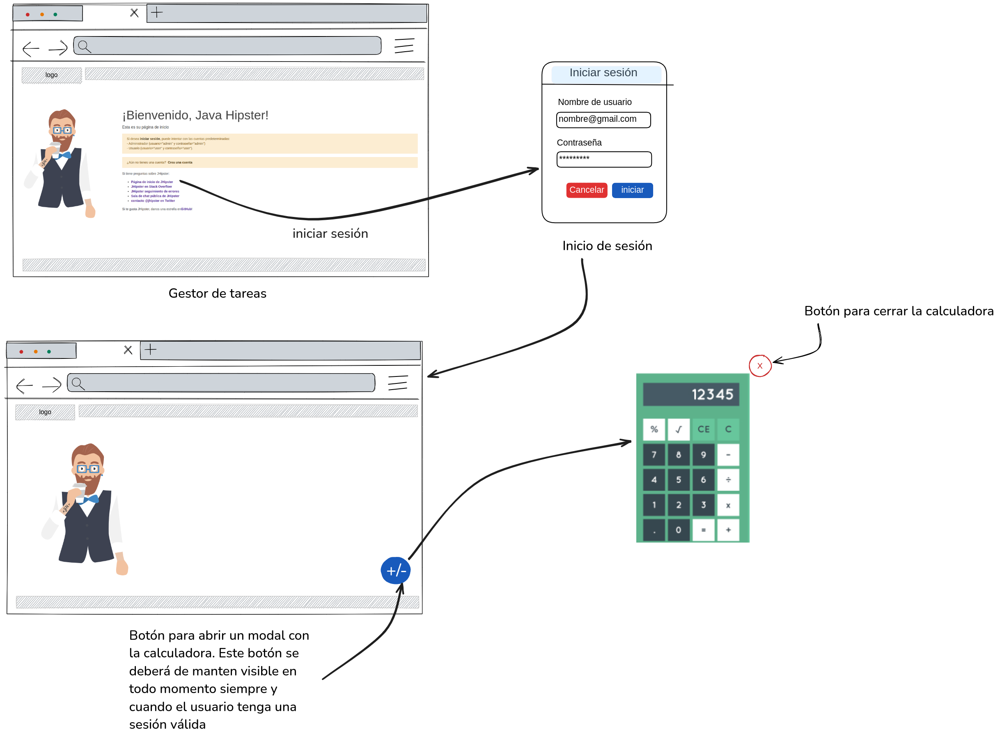

# Calculadora

El objectivo de esta práctica es crear un componente que implemente las funcionalidades básicas de una calculadora, con la finalidad de que un usuario de la plataforma pueda utilizarla mientras se encuentre con una sesión activa en la plataforma:

# Historias de usuario:

Como Usuario, quiero realizar la suma, resta, multiplicación, división, raíz cuadrada y la operación módulo entre dos números, con la finalidad de calcular operaciones rutinarias de mi trabajo.

## Criterios de aceptación
- Las operaciones se deberán de calcular con números de punto flotante con precisión a dos decimales
- La calculadora deberá de ser activada mediante un botón que deberá de estar siempre visible para los usuarios que tengan una sesión activa en la plataforma
- El botón que activa la calculadora, deberá de aparecer siempre en la parte inferior derecha de la pantalla

## Flujo esperado

